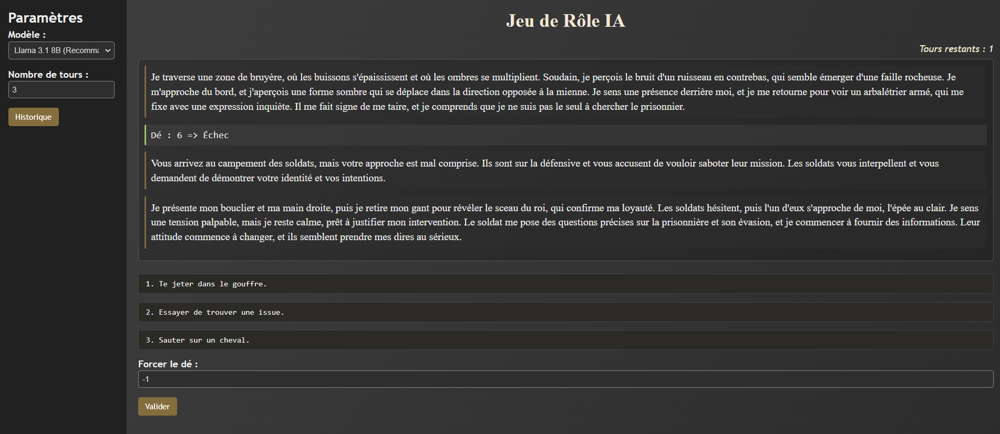

# Text RPG (WebLLM in French only)
This repository contains a text-based RPG adventure game where all gameplay, prompts, and narration are in French only.
The user plays whatever it wants to play as from an initial prompt. The story evolves dynamically based on choices (generated by an AI) and dice rolls, and the success or failure of those rolls directly impacts the scenario.

## Overview
This Text RPG is powered by a local LLM (Language Learning Model) setup (e.g., using web-llm). The game logic is written to:

- Present a short narration describing the scene in French,
- Offer exactly 3 choices to the user,
- Prompt the user to pick one choice and then roll a dice to determine success or failure,
- Describe the consequences of success or failure,
- Keep track of the story's continuity by summarizing major events, so the story remains coherent,
- Eventually end the adventure after a finite number of turns (defined by the user).

## Features

- French-Only Gameplay: All prompts, narration, and user choices are generated in French.
- Dice Rolls: Each user choice triggers an automatic dice roll, influencing success or failure.
- Debug Option for Dice: A small debug field to force a dice result (don't forget the validate button).
- Multiple generator: One for to set up the scene , one to create choices , one to describe the consequences of the failed/succeded choice
- Contextual Continuity: The scenario takes into account previous successes or failures, generating more immersive continuity.
- Multiple Model Support: Users can pick from a list of LLM models (e.g., Llama or Mistral) in the sidebar.
- Summaries to Avoid Repetition: Regular summarization to keep the text coherent and limit repeated details.
- History : The game can at any point be saved in it's entirety for future references
- No External Server: Entirely client-side, can be hosted on GitHub Pages or any static site.

## Requirements
A modern web browser (Chrome, Firefox, or Edge) that supports WebGPU (for web-llm) or whatever local LLM solution you use.

Internet connection if you rely on a CDN to load scripts (like web-llm).

Optionally, Node.js if you plan to bundle or serve it locally (but it can run as a static page on GitHub Pages).

## Usage
No dependencies are required, the github pages linked can be used as is. 

Enter the context initial in French (e.g., "Je suis un chevalier à la recherche d'un prisonnier qui s'est enfui dans une sombre forêt.").
The model might take a while to load at first , that's normal and you don't have to panic.

Select the model you want to use (e.g., Llama 3.1 8B).

Choose the number of turns for the adventure (e.g., 3, 5, 10, etc.).

Click "Commencer l'aventure".

A short French narration appears.

3 choices are offered. Pick one to continue.

A dice roll happens automatically to decide success or failure, and the text updates accordingly.

The story proceeds until the set number of turns is reached, or the user runs out of valid choices.

You can optionally force the dice result in the small debug input (useful for testing).

You can save your entire Story thanks to the Historique button on the side where a pop up will appear to have a preview and an option to save as an .txt file 

All gameplay is in French: the story, the descriptions, and the choices.

## Screenshot
Below is an example screenshot demonstrating a short scenario with the initial prompt:

« Je suis un chevalier à la recherche d'un prisonnier qui s'est enfui dans une sombre forêt. »

This screenshot shows a moment when the user had an Échec (failure) on dice roll 6, leading to a new scenario, then more choices appear at the bottom.

## License
This project is released under the IFT License. Feel free to modify and adapt it as you wish.

Have fun! 

